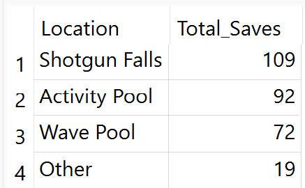
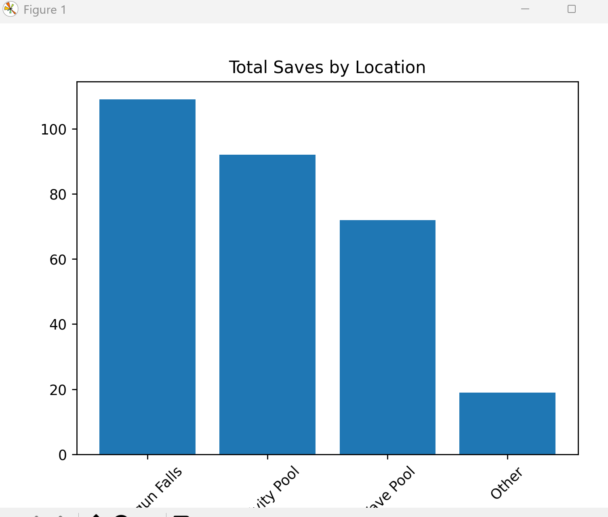
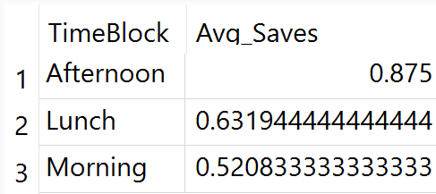
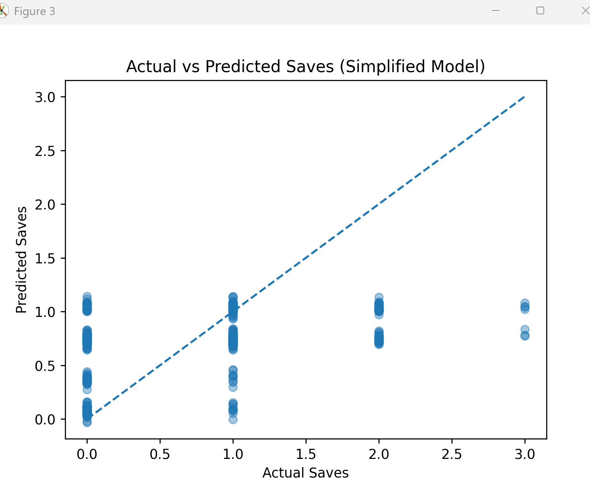

# Lifeguard Rescue Data Analysis

SQL + NumPy analysis of real lifeguard rescue data using a simplified linear regression model.

---

## Background

During Summer 2025 (June–September), I worked as a lifeguard at Calibunga Water Park.  
All rescues were recorded on official shift reports, including:

- Number of saves  
- Time of day  
- Location of rescue  

This project analyzes that real operational data to identify safety patterns and key drivers of rescues.

---

## Project Goals

- Identify which attractions generate the most rescues  
- Determine when rescues occur most frequently  
- Build a simplified regression model to measure risk factors  

The objective was to turn raw safety logs into clear, interpretable insights.

---

## Tools Used

- SQL (GROUP BY, SUM, AVG)  
- SQLite inside Python  
- Linear regression built from scratch using NumPy  
- Matplotlib for visualization  
- Model evaluation using MSE and R²  

---

## Rescue Distribution by Location

Shotgun Falls accounts for the highest number of rescues, showing that rescue activity is concentrated in specific high-risk attractions.

Additional breakdown of rescue distribution:

---

## Average Rescues by Time of Day

Rescue frequency peaks in the afternoon and is lower in the morning, suggesting risk increases as the day progresses.

---

## Simplified Regression Model

Features used:

- Temperature  
- Lifeguards_On_Duty  
- High_Risk_Location  
- Peak_Time  

Estimated model:

Saves = -0.50  
+ (0.0067 × Temperature)  
+ (0.0091 × Lifeguards_On_Duty)  
+ (0.6673 × High_Risk_Location)  
+ (0.2982 × Peak_Time)

### Interpretation

- High-risk locations have the strongest effect on rescue frequency.  
- Peak hours meaningfully increase expected rescues.  
- Temperature has a small positive impact.  
- Staffing levels show minimal influence in this simplified model.

---

## Model Performance

- MSE ≈ 0.45  
- R² ≈ 0.19  

The model explains about 19% of variation in rescue counts, indicating that many rescues are influenced by unpredictable behavioral or environmental factors.

---

## Model Fit Visualization

The plot below compares actual saves to predicted saves from the regression model.

---

## Key Takeaway

This project demonstrates the ability to:

- Extract operational insights using SQL  
- Build regression models without machine learning libraries  
- Interpret statistical output clearly  
- Translate data into practical safety insights  

Overall, high-risk attractions and peak hours are the primary contributors to rescue frequency.
